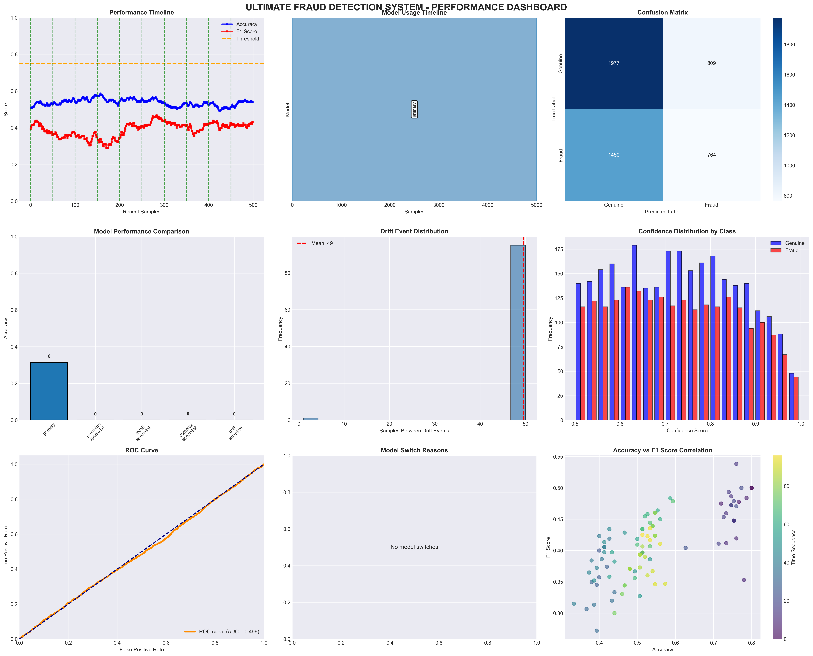
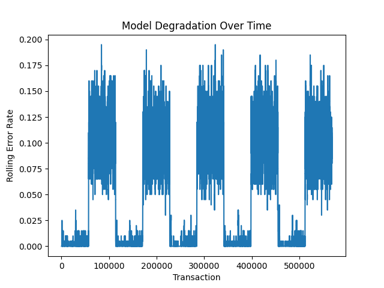
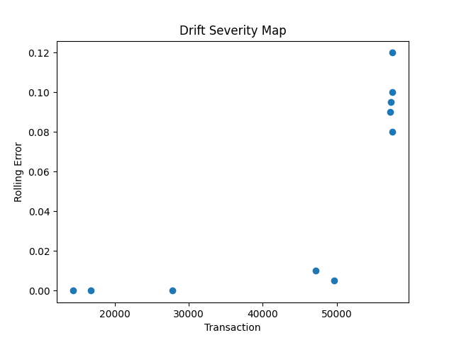
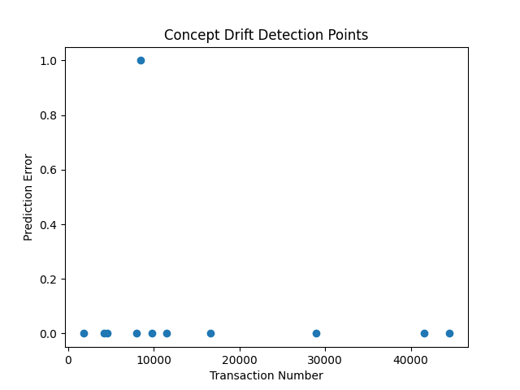

# Credit Card Fraud Detection with Concept Drift (CCFD)

## Overview

CCFD is a distributed fraud detection framework designed to handle concept drift in financial transaction data. The system combines fraud detection models, drift monitoring, adaptive retraining, and federated learning concepts to maintain model performance as data distributions evolve over time.

---

## Features

* Fraud detection pipeline
* Concept drift detection and monitoring
* Adaptive model retraining
* Federated learning simulation
* Multi-bank client architecture
* Performance visualization and analytics
* REST API integration

---

## Project Structure

```text
fraud-concept-drift/
│
├── clients/
├── server/
├── api_server.py
├── frauddrift.py
├── drift_detector.py
├── drift_monitor.py
├── model_manager.py
├── run_all.py
├── requirements.txt
└── README.md
```

---

## Dataset Download

The datasets are hosted externally to keep the GitHub repository lightweight.

### Download Dataset

Download the dataset package from:

https://drive.google.com/file/d/1U-2ySc3mJEtV_qIaOpMf2lmWk20ovJzi/view?usp=sharing

### Setup Dataset

After downloading:

1. Extract the downloaded archive.
2. Place the `clients` folder in the project root directory.

Expected structure:

```text
fraud-concept-drift/
│
├── clients/
│   ├── bank1/
│   │   └── data.csv
│   ├── bank2/
│   │   └── data.csv
│   ├── bank3/
│   │   └── data.csv
│   ├── bank4/
│   │   └── data.csv
│   └── bank5/
│       └── data.csv
```

---

## Installation

### Clone the Repository

```bash
git clone https://github.com/chirumanipradyumnareddy/CCFD.git
cd CCFD
```

### Create a Virtual Environment

```bash
python -m venv venv
```

### Activate the Environment

#### Windows

```bash
venv\Scripts\activate
```

#### Linux / macOS

```bash
source venv/bin/activate
```

### Install Dependencies

```bash
pip install -r requirements.txt
```

---

## Running the Project

### Run the Complete System

```bash
python run_all.py
```

### Run the API Server

```bash
python api_server.py
```

---

## Results & Visualizations

### Performance Dashboard

The dashboard provides a consolidated view of fraud detection performance, concept drift monitoring, model accuracy trends, confusion matrix analysis, ROC evaluation, and system-level analytics.



---

### Model Degradation Analysis

This visualization demonstrates how model performance changes over time as transaction patterns evolve. The graph highlights the impact of concept drift and the need for adaptive retraining mechanisms.



---

### Drift Severity Monitoring

The drift severity map visualizes the magnitude of detected drift events. Higher values indicate stronger distribution shifts that may require model adaptation or retraining.



---

### Concept Drift Detection Points

Detected drift points are visualized across transaction streams, enabling analysis of distribution shifts and helping identify when model behavior begins to diverge from incoming data patterns.



---

## Technologies Used

* Python
* Machine Learning
* Federated Learning Concepts
* Concept Drift Detection
* REST APIs
* Data Analytics
* Pandas
* NumPy
* Scikit-learn

---

## Applications

* Financial fraud detection
* Real-time risk assessment
* Adaptive machine learning systems
* Federated analytics environments
* Concept drift research

---

## Future Enhancements

* Real-time streaming support
* Cloud deployment
* Containerized microservices
* Advanced federated learning integration
* Automated model lifecycle management

---

## Author

**Pradyumna Reddy**

---

## Repository Highlights

* Multi-bank distributed fraud detection architecture
* Concept drift monitoring and adaptive learning
* Performance analytics dashboard
* External dataset management for lightweight repositories
* Federated learning inspired workflow
* Research-oriented machine learning project suitable for academic and industry applications

```
```
